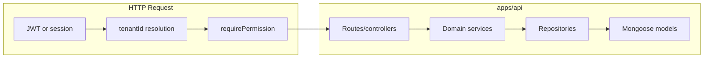

# Greenfield ERP/POS monorepo — Chunk 1 foundation

## Context

- Workspace `[/home/sameer/Documents/react/POS_1](/home/sameer/Documents/react/POS_1)` is **empty**; this chunk **creates** the monorepo from scratch (no prior files to diff against).
- **UI constraint:** Only **shadcn/ui** (Radix-based primitives in `packages/ui`) for dialogs, sheets, tables, forms, etc.—no other component libraries; no raw `<dialog>` for modals.
- **Stack:** **pnpm** workspaces + **Turborepo**, **TypeScript** everywhere, **Next.js (App Router)** in `apps/web`, **Node.js API** in `apps/api` with **MongoDB** via **Mongoose**, validation with **Zod**, passwords with **bcrypt** + server-only flows.

## Target layout (created in this chunk)

```text
apps/web          # Next.js App Router, Tailwind, imports @repo/ui
apps/api          # HTTP API (Fastify recommended: schema-friendly + hooks), layered modules
packages/ui       # shadcn components + shared layout primitives (exported)
packages/types    # Shared TS contracts (API request/response shapes, enums)
packages/config   # Env schema (Zod), shared constants, Tailwind preset optional
packages/utils    # Money, IDs, tax helpers stub, tenant-scope helpers, errors
packages/permissions # Permission registry + role→permission map + business-type filter helpers
packages/business-type-engine # Registry, feature/menu/field maps, resolvers (Retail, Supermart)
packages/pdf      # Package scaffold + stub exports (implement in later chunk)
packages/payments # Types + provider interface stub + noop/local provider (Razorpay in later chunk)
```

## Architecture (tenant + RBAC)




- **Every** query/mutation includes `tenantId` from auth context (ObjectId or string, consistent across codebase).
- **Guards:** Fastify `preHandler` hooks: `authenticate`, `requireTenant`, `requirePermissions(...)`.
- **Business type:** Stored on tenant; `packages/business-type-engine` exposes `getFeatureMap`, `getMenuForRole`, `filterPermissionsByBusinessType`; API returns **effective menu/features** for the session; web **must not** be sole enforcer.

## Execution order within this chunk (your list 1–7 + scaffolding for 8–16)


| Priority | Deliver in Chunk 1                                                                                                                                                                                                                                  |
| -------- | --------------------------------------------------------------------------------------------------------------------------------------------------------------------------------------------------------------------------------------------------- |
| 1–2      | Business-type engine package + tenant/business + `BusinessSettings` initialization on create                                                                                                                                                        |
| 3–4      | Permission registry, role matrix, route guards, frontend menu/action gating helpers                                                                                                                                                                 |
| 5        | User management: CRUD, activate/deactivate, role assign, **only owner/admin** create user + set/reset password; audit entries for user/password/role/status                                                                                         |
| 6–7      | Category CRUD (parent = subcategory), Product CRUD (SKU, barcode, prices, GST slab ref, tax mode, stock flag, status)                                                                                                                               |
| 8–9      | `InventoryItem` linked to `Product`, branch placeholder, opening/current stock, reorder level, low-stock flag; `StockMovement` model + **service-only** adjust/in/out/correction; movement audit; **no** negative stock if tenant setting disallows |
| 10       | Customer + Supplier CRUD + list/detail API + web CRUD                                                                                                                                                                                               |
| 11–16    | **Scaffold only** in Chunk 1: route stubs, empty handlers or minimal read endpoints, package stubs (`pdf`, `payments` interface) so Chunk 2 wires POS → invoice → payment without moving files                                                      |


**Chunk 2 (planned, not implemented now):** POS shell, `Invoice`/`InvoiceItem` lifecycle, `GstSlab`/`TaxSetting` CRUD + centralized tax service, `Payment`, `QrPaymentSession`, Razorpay provider adapter, `Receipt`/`Refund`, `packages/pdf` templates + viewer page, gateway settings, full stock history UI, refunds UI.

## Backend layering (`apps/api`)

Per module folder pattern:

- `routes/*.ts` — HTTP, Zod-validated body/query, call service
- `services/*.ts` — business rules, transactions
- `repositories/*.ts` — Mongoose queries (tenant-scoped)
- `schemas/` or `models/` — Mongoose schemas
- `validators/` — Zod DTOs shared intent with `packages/types` where useful
- `plugins/` — auth, audit, error formatter

**Core models (Chunk 1):** `Tenant`, `BusinessSettings`, `User`, `AuditLog`, `Category`, `Product`, `InventoryItem`, `StockMovement`, `Customer`, `Supplier`, `GstSlab` (minimal fields for product linkage), optional `Role` as embedded enum on User or separate collection—**recommend** role as string enum on `User` + permissions derived from `packages/permissions` to avoid duplication.

**Audit:** Central `auditService.log({ tenantId, actorId, action, entity, entityId, metadata })` called from user, category, product, inventory, stock services.

## Frontend (`apps/web`)

- **App Router** layout: sidebar + header using `@repo/ui` (shadcn **Sidebar** / **Sheet** / **DropdownMenu** / **Button** / **Card** / **Table** / **Form** with react-hook-form + zod).
- **Auth pages:** login; **onboarding** wizard (business name, type Retail|Supermart, owner user) calling tenant create + seed settings.
- **CRUD pages (Chunk 1):** Users (list, sheet create/edit, detail), Roles/permissions read-only summary, Categories, Products (list, form sheet, detail), Inventory list/detail, Stock adjustment form (calls API), Customers, Suppliers, Dashboard placeholder.
- **Menu gating:** Load `me` + `tenant` + `features` from API; build nav from `packages/business-type-engine` menu map **filtered** by permissions.

## Shared packages — responsibilities

- `**[packages/business-type-engine](packages/business-type-engine)`:** `BUSINESS_TYPES`, `registry`, `featureMap`, `menuMap`, `permissionFilter`, `resolveProductFields`, placeholders for inventory/POS/invoice maps (typed, extensible by adding config objects).
- `**[packages/permissions](packages/permissions)`:** `Permission` const object, `ROLE_PERMISSIONS`, `hasPermission(role, perm)`, `assertPermission`.
- `**[packages/types](packages/types)`:** DTOs for API boundaries (UserPublic, TenantDTO, etc.).
- `**[packages/utils](packages/utils)`:** `money` (minor units or decimal.js later—start with integer paise-safe helpers), `generateDocumentNumber` stub, `ApiError` shape.
- `**[packages/config](packages/config)`:** `envSchema` for `MONGODB_URI`, `JWT_SECRET`, `WEB_ORIGIN`, etc.
- `**[packages/ui](packages/ui)`:** shadcn components; export barrel; peer deps `react`, `react-dom`; consumer provides Tailwind content paths to scan `packages/ui`.

## API surface (Chunk 1 — representative)

- `POST /auth/register-onboarding` (creates tenant + owner) vs `POST /auth/login`
- `GET /me`, `GET /tenant/features` (or combined)
- `CRUD /users` with password routes `POST /users/:id/reset-password` (owner/admin only)
- `CRUD /categories`, `CRUD /products`, `GET/POST/PATCH /inventory`, `POST /stock/movements`
- `CRUD /customers`, `CRUD /suppliers`
- Stub: `GET /invoices` empty list, etc., so web routes exist without fake data logic

## Quality / safety rules (enforced in code)

- No financial totals computed only on client; invoice/payment totals in Chunk 2 on server.
- Stock mutations **only** through `stockService` / `inventoryService`.
- Passwords never returned in JSON; reset uses server-generated or admin-provided secret over HTTPS only.

## Risk note

Delivering **all** 22 modules with full production depth in a **single** chunk is not feasible; this plan **completes** items **1–10** in depth and **scaffolds** **11–22** so the next chunk extends without breaking contracts.

## Implementation todos

